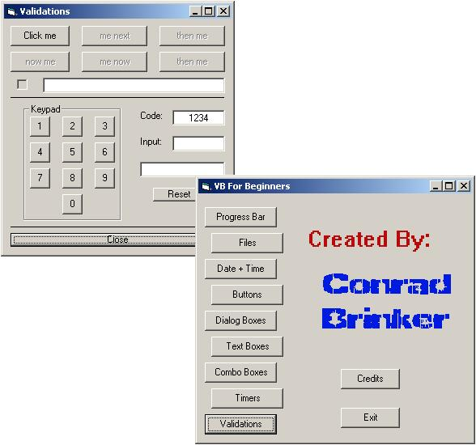



## VB Form Basics

### Description

Great for VB learners! This program will help show you a lot of effects using forms. Almost every line of code is commented. Perfect for a beginner. Please leave comments and vote for me! Thanks guys!!!
 
### More Info
 

             |
---                |---
**Submitted On**   |2002-09-03 16:47:18
**By**             |[Conrad Brinker](https://github.com/Planet-Source-Code/PSCIndex/blob/master/ByAuthor/conrad-brinker.md)
**Level**          |Intermediate
**User Rating**    |5.0 (20 globes from 4 users)
**Compatibility**  |VB 5\.0, VB 6\.0
**Category**       |[Coding Standards](https://github.com/Planet-Source-Code/PSCIndex/blob/master/ByCategory/coding-standards__1-43.md)
**World**          |[Visual Basic](https://github.com/Planet-Source-Code/PSCIndex/blob/master/ByWorld/visual-basic.md)
**Archive File**   |[VB\_Form\_Ba126234932002\.zip](https://github.com/Planet-Source-Code/conrad-brinker-vb-form-basics__1-38639/archive/master.zip)

